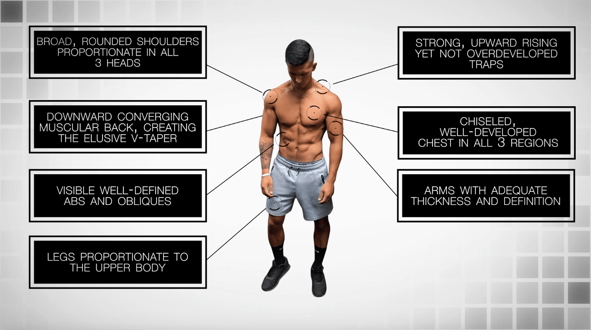

# sculpting a broad-shouldered, proportionate, and athletic looking physique
1. Broad, rounded shoulders that are well balanced in all three heads in order create the elusive “V-taper” shape
2. A chiseled chest that is full yet well developed within the upper, middle, and lower regions
3. A muscular back with adequate thickness AND width to add to the “V-taper” shape
4. Strong yet not overdeveloped upper traps to create a powerful looking upper body
5. Thick and well defined arms with proportionate balance between the biceps and triceps
6. Visible, defined abdominals and obliques to compliment the upper body muscles
7. Legs that are proportionate to the upper body yet not bulky in order to complete the “athletic” look 

And *in order to achieve the above*, I’ve chosen 6 key lifts (based on both anecdotal and scientific evidence) that will be your ultimate focus during this program.

# the big 6
1. Bench Press
2. Incline Dumbbell Press
3. Standing Overhead Press
4. Pull-Ups
5. Deadlift
6. Squat

# Routine
Monday – Upper
Tuesday – Lower 1
Wednesday – Rest
Thursday – Push
Friday – Pull
Saturday - Legs (Lower 2)
Sunday - Rest

## upper 
1. bench press x 4 x (4-6) with 3-min rest
2. chest-supported row x 3 x (6-8) with 2-min rest
3. standing overhead press x 3 x (8-10) with 2-3-min rest
4. lat pulldown x 3 x (10-12) with 2-min rest
5. high to low cable flies x 3 x (12-15) with 1.5-2-min rest
6. lying face pulls x 3 x (10-12) with 1.5-2-min rest

## lower
1. front squat x 3 x (10-12) with 2.5-3-min rest
2. deadlift x 4 x (6-8) with 3-min rest
3. barbell hip thrust x 4 x (8-12) with 2-min rest
4. single leg weighted calf raise x 3 x (6-9) with 1-1.5-min rest
5. leg press calf raise x 3 x (8-12) x 1-1.5-min rest

## push 
1. incline dumbbell press x 3 x (8-10) with 2-3-min rest
2. flat dumbbell press (RPT) x 3 x (6-12) with 2-3-min rest
3. lateral raises (cable & dumbbell) x 4 x (8-12) with 1-min rest
4. banded push-ups x 2 x 10+ with 1.5-2-min rest
5. overhead rope extensions x 3 x (12-15) with 1.5-2-min rest
6. bar tricep pushdowns x 3 x (8-12) with 1.5-2-min rest

## pull
1. weighted pull ups (RPT) x 3 x (4-10) with 2.5-3-min rest
2. seated row x 3 x (8-10) with 2-min rest
3. reverse pec deck x 3 x (10-12) with 2-min rest
4. kneeling face pulls x 4 x (10-15) with 1.5-min rest
5. inclince dumbbell curls x 3 x (8-10) with 1.5-2-min rest
6. hammer curls x 3 x (8-10) with 1.5-2-min rest
7. scapular pull-ups x 2 x (5-10+) with 1-min rest 

## legs (lower body 2)
1. back squat x 4 x (6-8) with 3-min rest
2. bulgarian split squat x 4 x (8-10), 1-min rest
3. glute ham raise x 4 x (10-12), 2-min rest
4. smith machine calf raise x 3 x (10-15), 1.5-min rest
5. seated weighted calf raise x 3 x (10-15), 1.5-min rest

## abs (2x per week)
1. circuite 1 
    1. decline (weighted) sit-up x 3 x (10-15)
    2. haning leg raise x 3 x (8-12)
    3. thread the needle plank x 3 x 10 each side 
2. circuit 2 
    1. weighted cable crunch x 3 x (10-15)
    2. hollow body holds x 3 x 30s hold
    3. high to low cable woodchoppers x 3 x (10-15) each side 

# warm up + heat up + exercise + cool down
    
1. warm up
    1. upper
        1. wrist circle x 10 each direction
        2. arm circle x 10 each direction
        3. band over-and-backs x 5
        4. band pull-aparts x 10 
        5. band external rotation x 10 each side
        6. DB shoulder extensions x 10 each side
    2. lower
        1. light cycling x 3 min
        2. forward & back leg swing x 10 each side
        3. side-to-side leg swings x 10 each side
        4. spiderman lunge with thoracic extension x 5 each side 
        5. wall ankle mobilization x 5 each side + 2-sec hold
2. heat up
    1. 50% of working weight x 8, 1-min rest
3. exercise: upper/lower + push/pull 
4. cool down: Foam roll: quadriceps, hamstrings, hip flexors, and calves

